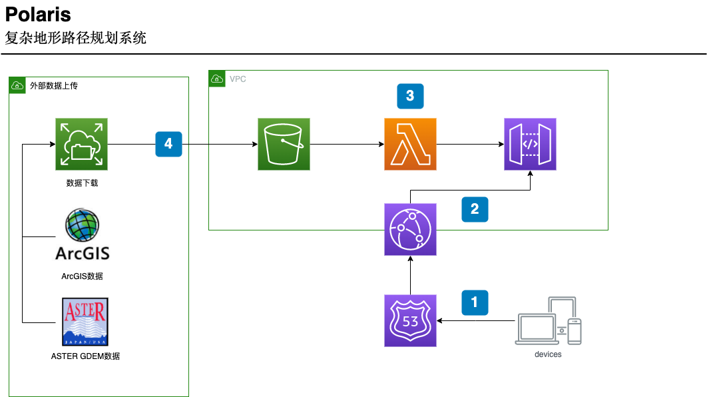

# **Polaris**

遥感高程辅助复杂地形路径规划系统

## **功能介绍**

本系统可根据**卫星遥感高程数据**（ASTER GDEM 30M 分辨率数字高程数据）建立基于 web 应用的可交互三维地形路线规划软件。

本系统通过设置目标最终抵达位置进行路线初始化，默认路线规划算法采用**梯度下降法**，也可采用最短路线法等其他方法；并可设置途经点、避障避悬崖、最大路线长度、最大登山时长、最大坡度等规划模型的边界条件。

系统在刷新后会自动从路线起点开始以游标动画形式展示登山路径，并提供实时的三维交互、展示路线途径点海拔高度。

## **试用 Demo**
登录 **Polaris Demo**  系统将自动刷新登山路线。

[西藏林芝米林县 登山路线](https://ck-wd3.s3.us-west-2.amazonaws.com/milin.html)

[四川甘孜香格里拉 登山路线](https://ck-wd3.s3.us-west-2.amazonaws.com/shangrila.html)

## **使用方法**

### 手机、平板
1. 放缩: 两指按屏, 反向来回滑动；
2. 平移: 单指按屏滑动；
3. 旋转: 两指按屏, 太极旋转滑动；
4. 俯仰: 两指按屏, 同向平行滑动。

### Windows
1. 放缩: 鼠标中键滚轮上下滚动；
2. 平移: 按住鼠标左键滑动；
3. 旋转: 按住鼠标右键水平滑动 **或** 按住 ctrl 键 + 按住鼠标左键水平滑动；
4. 俯仰: 按住鼠标右键上下滑动 **或** 按住 ctrl 键 + 按住鼠标左键垂直滑动。

### Mac
1. 放缩: 触摸板两指滑动；
2. 平移: 触摸板单指按住滑动；
3. 旋转: 两指按住触摸板水平滑动 **或** 按住 control 键 + 单指按住触摸板水平滑动；
4. 俯仰: 两指按住触摸板垂直滑动 **或** 按住 control 键 + 单指按住触摸板垂直滑动。

## **架构设计图**

公开版方案采用云原生的托管服务来建设服务：

1. 用户通过直接访问前端网络端口，获得地理信息服务的接入。
2. 前端界面会向后端 *API Gateway* 发送 **路径计算** 请求。
3. 通过 *AWS Lambda* 服务，计算出路径结果，返回给前端界面调用。
4. 系统依赖的遥感数据，经过高程数据接口进行日常维护，存储在对象数据存储中心，供计算单元调用。

<h2 id="__comments">讨论区</h2>
<form id="gitalk-form" onsubmit="return false;">
    

</form>
<link rel="stylesheet" href="https://unpkg.com/gitalk/dist/gitalk.css">

